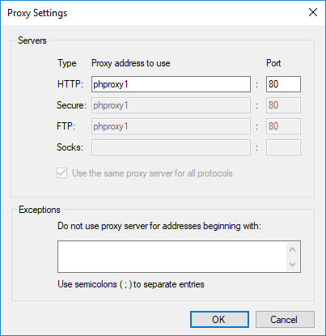

# InternetProxySettings

This mini-application is used to easily set the '<b>Internet Proxy Settings</b>' on a Microsoft Window's PC.
  1. Combines the following multiple steps normally required to make a change to the proxy into one: 
      -  Searching for and opening the "Internet Properties" window.
      -  Selecting the "Connections" tab.
      -  Clicking the "LAN settings" button.
     
  2. Provides optional '<i>command-line</i>' access for setting the values (such as turning the proxy on or off).

Running the application displays the following window:

 Settings")

Click the 'OK' button to save any changes made in this window (plus any changes made in the "advanced" window) 
then exit this mini-app.

Click the 'Cancel' button to close the mini-app without making any changes.

Click the 'Advanced' button to display this window:

Click the 'OK' button to maintain these changes and return to the previous window.

Click the 'Cancel' button to dismiss this window without making any changes.
